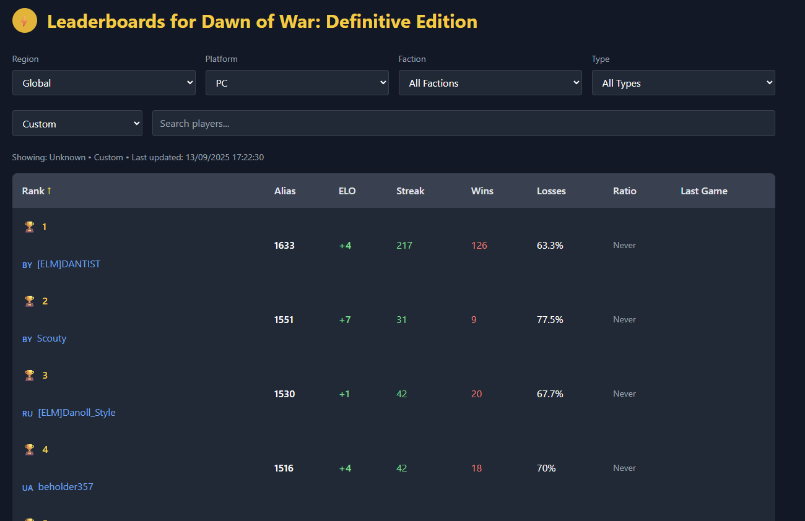

# Dawn of War: Definitive Edition Leaderboards

A modern, mobile-friendly leaderboard site for Dawn of War: Definitive Edition.
Live: https://www.dow-de.com



## Feature Overview

- Leaderboards: live ladders with filters, sorting, and shareable URLs
- Search: player lookup across ladders with Steam-enriched names
- Profiles: player stats, recent matches, and rank movement
- Advanced Stats: matchup, map, and race breakdowns (Supabase-backed)
- Replays: upload, browse, and download shared replays

## Tech Stack

- Next.js 14 + TypeScript
- Tailwind CSS
- Relic Community API + Steam API

## Quick Start

Prereqs: Node.js 18+, npm

```bash
npm install
npm run dev
```

Visit `http://localhost:3000`.

## Local Development (Supabase Required)

The app loads Supabase on startup, so local dev needs a Supabase project.

1. Create a Supabase project (cloud or local) and apply `supabase/migrations`.
2. Run the reference seed SQL: `supabase/seed/seed_reference.sql`.
3. Copy `.env.template` to `.env.local` and set:
   - `NEXT_PUBLIC_SUPABASE_URL`, `NEXT_PUBLIC_SUPABASE_ANON_KEY`
   - `SUPABASE_URL`, `SUPABASE_SERVICE_ROLE_KEY` (service role, server-side)
4. Optional: `npm run seed:leaderboards` to populate leaderboards/players.
5. Optional: `npm run enrich:players` for Steam names, levels, and countries.
6. Optional: deploy `supabase/functions/steam-player-count` and schedule it to
   keep the live player badge updated.

## Scripts

```bash
npm run dev
npm run build
npm start
npm run lint
```

## Documentation

- API details: `API-DOCUMENTATION.md`
- Data collection tools: `ADVANCED-STATISTICS.md`
- Deployment notes: `docs/pro-deployment-summary.md`

## Contributing

We welcome fixes, features, and docs improvements.

- Browse or file issues: https://github.com/EnzeD/dow-leaderboards/issues
- Fork and create a branch: `git checkout -b feat/short-description`
- Keep changes focused and follow existing patterns
- Run `npm run lint` before opening a PR
- Open a PR with a clear summary and screenshots for UI changes