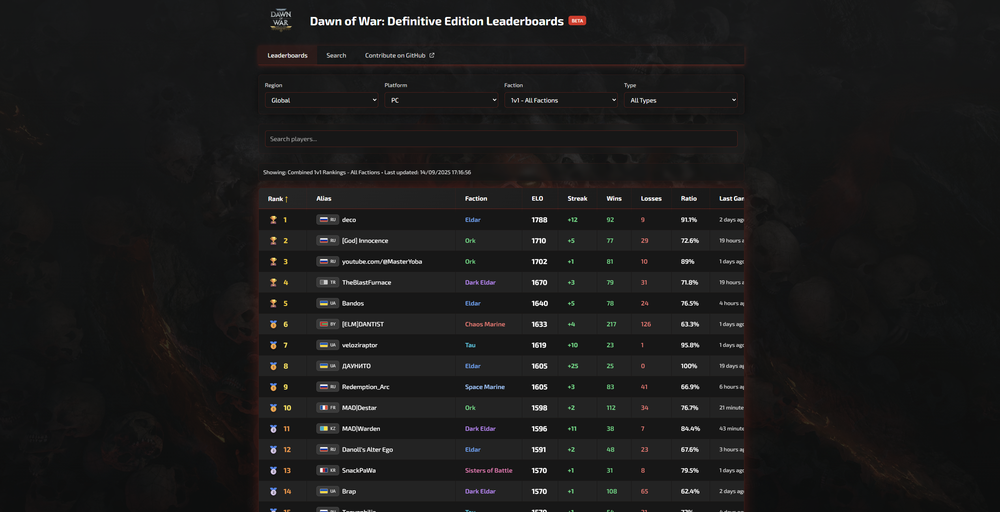

# Dawn of War: Definitive Edition Leaderboards

A modern, mobile-friendly leaderboard website for Dawn of War: Definitive Edition, displaying live rankings and player statistics from Relic's Community API.

Live: https://www.dow-de.com



## 🚀 Features

- **Live Data**: Real-time leaderboard data from Relic Community API
- **Complete Coverage**: All 37 leaderboards (1v1-4v4 for all factions)
- **Player Search**: Find players across all leaderboards by Steam name or alias
- **Steam Integration**: Enhanced with Steam player names (≥90% success rate)
- **Mobile-Friendly**: Responsive design optimized for all devices
- **Advanced Filtering**: Sort by rank, rating, wins, losses, winrate, and more
- **Flag System**: CSS-based country flags for international players
- **Shareable URLs**: Filters/search/support reflected in the URL; default leaderboards keep a clean root (`/`). Copy-link buttons in the UI.
- **Smarter Search UX**: On leaderboards, no-match searches auto-expand results (top 200 → top 1000) and revert when cleared; suggest profile search if still none.
- **Faction Logos**: Color‑matched icons in Faction columns and search sections for quick visual parsing.

## 🛠 Tech Stack

- **Framework**: Next.js 14 with TypeScript
- **Styling**: Tailwind CSS
- **Data Sources**: Relic Community API + Steam API
- **Deployment**: Ready for Vercel/Netlify

## 🏃‍♂️ Quick Start

### Prerequisites

- Node.js 18+
- npm or yarn

### Installation

```bash
# Clone the repository
git clone https://github.com/EnzeD/dow-leaderboards.git
cd dow-leaderboards

# Install dependencies
npm install

# Start development server
npm run dev
```

Visit `http://localhost:3000` to see the application.

Production is available at `https://www.dow-de.com`.

### Steam Player Count

The site shows the live Steam player count in the header. It uses Steam’s
`GetNumberOfCurrentPlayers` and defaults to the Dawn of War: Definitive Edition
App ID `3556750` — no configuration required.

If you want to override it for another app, you may set `STEAM_APP_ID_DOW_DE`
in your environment, but this is optional.

### Build for Production

```bash
npm run build
npm start
```

## 🗄 Supabase Seeding

Once your Supabase project is provisioned (migrations + reference seed applied), you can capture an initial snapshot of every Relic leaderboard and populate the `players` table in one pass.

1. Copy `.env.template` to `.env` and fill in `SUPABASE_URL` plus `SUPABASE_SERVICE_ROLE_KEY` (service role key lives in the Supabase dashboard under Project Settings → API).
2. Optional: adjust `LEADERBOARD_SNAPSHOT_MAX` (defaults to 200 to match Relic’s cap), `LEADERBOARD_PAGE_SIZE`, or `LEADERBOARD_SNAPSHOT_SOURCE` to tune batch size/source tagging.
3. Run the seeding script: `npm run seed:leaderboards`

The script pulls every leaderboard directly from the Relic API, inserts/updates matching rows in `leaderboards`, records a snapshot for the current UTC day, and upserts all discovered players (alias + country + last_seen_at) into `players`. It respects Relic's soft rate limits with a small delay between pages; expect the run to take a minute or two for all 37 ladders.

## 🔍 Advanced Data Collection & Monitoring

This project includes sophisticated data collection and monitoring systems for comprehensive match and player data.

### 🎯 Player Enrichment

**Purpose**: Enhance player data with Steam IDs, levels, XP, and country information.

#### Quick Start
```bash

# Run enrichment
npm run enrich:players

# Monitor progress in another terminal
npm run monitor:enrichment
```

#### What It Does
- **Enriches existing players** with missing Steam ID, level, XP, and country data
- **High success rate**: ~99% of players get enriched with complete data
- **Optimized performance**: Processes 2,000 players per batch with 10 concurrent workers
- **Smart API usage**: 100ms delays between requests (~100 req/s total, well under limits)
- **Automatic rate limiting**: Built-in request caps and delays

### 🕷️ Match History Crawling

**Purpose**: Systematically collect match histories for all players to build a comprehensive match database.

#### Quick Start
```bash
# Check current crawler status
npm run crawl:status

# Start crawling (runs continuously)
node scripts/crawl-player-matches.mjs

# Monitor in real-time (separate terminal)
npm run crawl:watch

# Clean up stuck jobs if needed
npm run crawl:cleanup
```

#### How It Works
The crawler uses a **job queue system**:
1. **Jobs are created** for each player profile that needs match history
2. **Workers process jobs** by fetching match data from Relic API
3. **New players discovered** in matches get added to the queue automatically
4. **Cooldown system** prevents redundant API calls (3-hour default)

#### Job States Explained
- **Pending**: Jobs waiting to be processed
- **In Progress**: Currently being worked on
- **Done**: Successfully completed
- **Failed**: Hit max retry attempts
- **On Cooldown**: Deferred because player was recently processed

#### Available Commands
```bash
# One-time status check (with enhanced coverage metrics)
npm run crawl:status

# Live monitoring (updates every 15 seconds)
npm run crawl:watch

# Clean up stuck jobs
npm run crawl:cleanup
```

#### Enhanced Status Metrics
The status monitor now provides comprehensive database coverage insights:

**👥 Player Database Coverage:**
- **Total Players**: All players discovered across leaderboards and matches
- **Ever Crawled**: Players whose match history has been collected (%)
- **Never Crawled**: Players still needing match history collection (%)
- **Recent Activity**: Players seen in last 24h/week

**📈 Match Participant Coverage:**
- **Total in Matches**: Unique players found in collected match data
- **Found in Players DB**: How many match participants exist in players table (%)
- **Missing from DB**: Players appearing in matches but not in players database

These metrics help you understand:
1. **Crawling Progress**: What percentage of known players have been processed
2. **Data Completeness**: Whether match participants are properly linked to player profiles
3. **Discovery Gaps**: Players found in matches but missing from main database

### 📊 Status Indicators Guide

#### Crawler Status Meanings
- **🟢 ACTIVE**: Jobs are ready and waiting to be processed
- **🟡 WAITING**: All jobs are on cooldown, next batch ready in X minutes
- **✅ COMPLETE**: All discovered players have been processed
- **⚠️ STUCK**: Some jobs need manual reset (use `npm run crawl:cleanup`)
- **⏳ PROCESSING**: Jobs are currently being worked on

#### When Is Crawling "Done"?
Crawling is complete when:
1. **Script shows "COMPLETE" status**, or
2. **Script exits** with "No more jobs available" (if `EXIT_ON_IDLE=true`), or
3. **Database query** shows no pending jobs:
   ```sql
   SELECT COUNT(*) FROM crawl_jobs
   WHERE status = 'pending' AND run_after <= NOW();
   -- Should return 0
   ```

### 📋 Quick Reference Commands

**For Beginners - Essential Commands:**
```bash
# 1. Check what's happening with your data
npm run crawl:status          # Shows crawler progress
npm run monitor:enrichment    # Shows player enrichment progress

# 2. Start data collection
npm run enrich:players        # Enhance player data (run once)
node scripts/crawl-player-matches.mjs  # Collect matches (runs continuously)

# 3. Fix problems
npm run crawl:cleanup         # Reset stuck jobs
```

**Typical Workflow:**
1. **First time setup**: Run `npm run enrich:players` to enhance all your players
2. **Start match collection**: Run `node scripts/crawl-player-matches.mjs`
3. **Monitor progress**: Use `npm run crawl:watch` to see live updates
4. **If something breaks**: Use `npm run crawl:cleanup` then restart

### 🛠️ Configuration & Tuning

#### Environment Variables
All scripts respect these `.env` settings:

**Player Enrichment** (optimized defaults):
```bash
ENRICH_PLAYER_LIMIT=2000      # Players per batch
ENRICH_CONCURRENCY=10         # Parallel workers
ENRICH_RELIC_DELAY_MS=100     # Delay between API calls
ENRICH_RELIC_REQUEST_CAP=50000 # Total API call limit
```

**Match Crawling** (optimized):
```bash
CRAWL_COOLDOWN_MINUTES=60     # Reduced cooldown (was 180)
CRAWL_RELIC_DELAY_MS=100      # Faster API calls (was 350)
CRAWL_RELIC_REQUEST_CAP=50000 # Higher API limit (was 6000)
CRAWL_UPSERT_CHUNK_SIZE=500   # Larger DB batches (was 300)
CRAWL_EXIT_ON_IDLE=true       # Auto-exit when no jobs available

# Concurrent crawler settings (npm run crawl:concurrent)
CRAWL_CONCURRENCY=6           # Parallel workers for concurrent version
CRAWL_BATCH_SIZE=20          # Jobs processed per batch
```

#### Performance Guidelines

| Operation | Original | Optimized | Concurrent | Usage |
|-----------|----------|-----------|------------|--------|
| **Player Enrichment** | ~2 hours | **~21 minutes** | N/A | `npm run enrich:players` |
| **Match Crawling** | ~2,000/hour | **~6,000/hour** | **~15,000/hour** | See commands below |

**Crawling Commands:**
```bash
# Original crawler (slower but stable)
node scripts/crawl-player-matches.mjs

# Concurrent crawler (recommended for speed)
npm run crawl:concurrent
```

**Safety Notes:**
- **API limits**: All versions stay well under Relic's 50 req/s limit
- **Safe concurrency**: Can run enrichment + crawling simultaneously
- **Database safety**: Concurrent version uses proper transaction handling

### 🚨 Troubleshooting

#### Common Issues & Solutions

**Stuck Jobs**:
```bash
# Problem: Jobs stuck in "in_progress" status
# Solution: Run cleanup script
npm run crawl:cleanup
```

**Slow Performance**:
```bash
# Check if you're hitting API limits
npm run crawl:status
# Look for high error rates or failed jobs
```

**Database Connection Issues**:
```bash
# Verify environment variables are set:
echo $SUPABASE_URL
echo $SUPABASE_SERVICE_ROLE_KEY
```

**Memory Usage**:
- Large batches may use significant memory
- Consider reducing `ENRICH_PLAYER_LIMIT` if running on constrained systems

#### Getting Help
If you encounter issues:
1. Check the status with `npm run crawl:status` or `npm run monitor:enrichment`
2. Look at the console logs for specific error messages
3. Verify your `.env` configuration matches the examples above
4. Use cleanup scripts if jobs appear stuck

## 🤝 Contributing

We welcome contributions! Here are some ways you can help:

### 🐛 Bug Reports & Feature Requests
- Report bugs via [GitHub Issues](https://github.com/EnzeD/dow-leaderboards/issues)
- Suggest new features or improvements
- Help test the application across different devices

### 💻 Code Contributions

#### Good First Issues
- **UI/UX Improvements**: Better mobile experience, dark/light theme toggle
- **Player Profiles**: Individual player pages with match history
- **Enhanced Search**: Advanced filters, faction-specific searches
- **Performance**: Caching improvements, optimization
- **Accessibility**: Screen reader support, keyboard navigation

#### Getting Started
1. Fork the repository
2. Create a feature branch: `git checkout -b feature/amazing-feature`
3. Make your changes following the existing code style
4. Test your changes locally
5. Commit with descriptive messages
6. Push and create a Pull Request

### 🎯 Development Guidelines

#### Code Style
- Follow existing TypeScript/React patterns
- Use Tailwind CSS for styling
- Keep components modular and reusable
- Add proper error handling

#### API Integration
- All data comes from Relic Community API (`https://dow-api.reliclink.com`)
- Always pass `title=dow1-de` parameter
- Respect rate limits (≤50 req/s, implemented as ≤8 req/s)
- Handle API failures gracefully

#### Key Files
- `src/lib/relic.ts` - Core API functions
- `src/app/api/` - Next.js API routes
- `src/app/page.tsx` - Main UI components

## 📊 Project Status

**✅ Current Features**
- Fully functional prototype with live data
- Complete UI with sorting, filtering, search
- Steam name enrichment working
- Mobile-responsive design
- Rate limiting and error handling
- Basic 'exact-match' search

**🚧 Potential Enhancements**
- Player profile pages
- Historical data tracking
- Advanced caching (Redis/KV)
- Performance analytics
- Match history integration

## 🔧 Architecture

### Data Flow
1. **Leaderboards**: Cached for 24h from `GetAvailableLeaderboards`
2. **Ladder Data**: Cached for 5 minutes from `getLeaderBoard2` (Top-200)
3. **Steam Names**: Batch resolution via `proxysteamuserrequest`

### API Endpoints
- `/api/leaderboards` — Available leaderboard list
- `/api/cache/leaderboard/[id]` — Cached leaderboard rows (default 200)
- `/api/cache/leaderboard/[id]/[limit]` — Extended rows (e.g., 1000)
- `/api/cache/combined-1v1` and `/api/cache/combined-1v1/[limit]` — Combined 1v1 across factions
- `/api/cache/player/by-alias/[alias]` — Player profile + stats + recent matches

## 📝 License

This project is open source and available under the MIT License.

## 🙏 Acknowledgments

- **Relic Entertainment** - For Dawn of War: Definitive Edition and Community API
- **Community** - All the players who make the leaderboards competitive
- **Contributors** - Everyone who helps improve this project

---

**Ready to contribute?** Check out our [GitHub Issues](https://github.com/EnzeD/dow-leaderboards/issues) or start with the codebase exploration!
